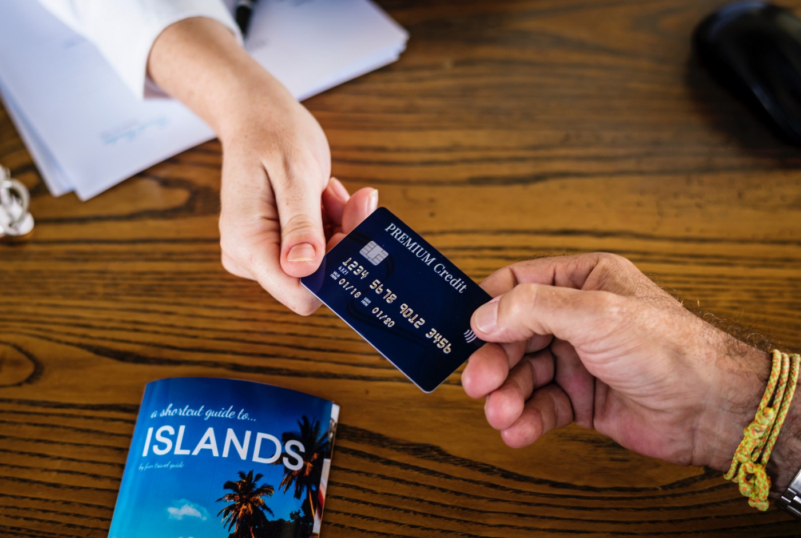

## Authors

- [@Naman Dalsania](https://github.com/namandalsania)
- [@Devang Punatar](https://github.com/splend9)

## Aim

This application predicts whether a credit card applicant will be accepted or denied. Each time there is a hard query your credit score is impacted adversely. This application predicts your likelihood of approval without altering your credit score. Applicants may use this app to see if they will be accepted for a credit card without damaging their credit score.

## Data source

- [Kaggle credit card approval prediction](https://www.kaggle.com/rikdifos/credit-card-approval-prediction)

## Methods

- Exploratory data analysis
- Bivariate analysis
- Multivariate correlation
- Model deployment

## Tech Stack

- Python (refer to requirement.txt for the packages used in this project)
- Streamlit (interface for the model)

## Research Paper (IJRASET) - https://doi.org/10.22214/ijraset.2022.47369

