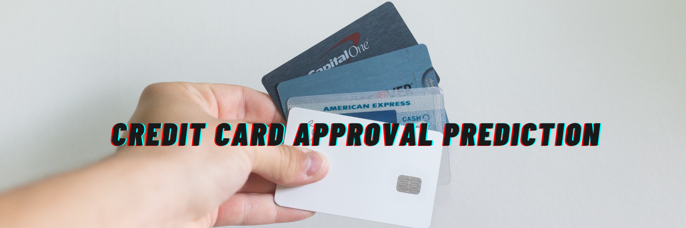

## Authors

- [@Naman](https://github.com/namandalsania)

## Business problem

This app predicts if an applicant will be approved for a credit card or not. Each time there is a hard enquiry your credit score is affected negatively. This app predict the probability of being approved without affecting your credit score. This app can be used by applicant who wants to find out if they will be approved for a credit card without affecting their credit score.

## Data source

- [Kaggle credit card approval prediction](https://www.kaggle.com/rikdifos/credit-card-approval-prediction)

## Methods

- Exploratory data analysis
- Bivariate analysis
- Multivariate correlation
- Model deployment

## Tech Stack

- Python (refer to requirement.txt for the packages used in this project)
- Streamlit (interface for the model)

